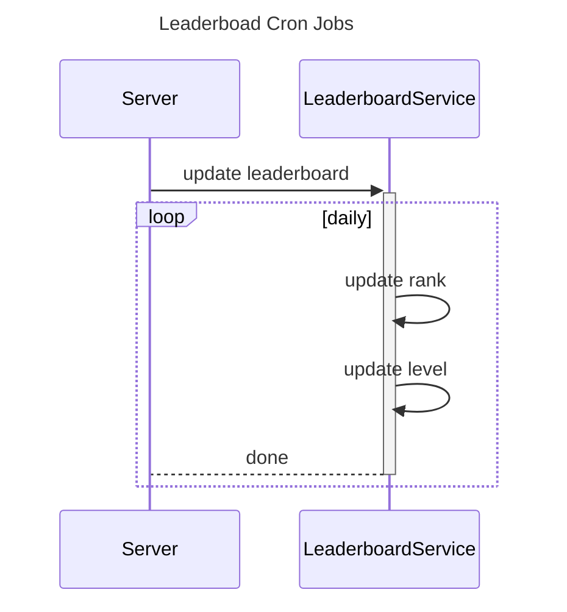
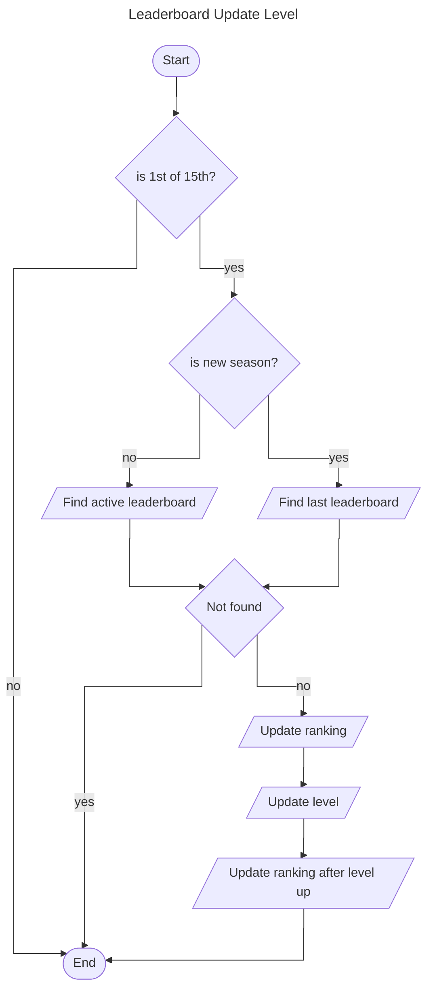

# Diagram as Code

## Status

`draft`

## Context

We want to explore using diagram as code tool such as Mermaid.js.


## Decisions

Use diagram as code.


### Cron Job

Example of a cron job that runs daily:



### Usecase as Flow Diagram

Start by providing the diagram, then explain each step where necessary:



#### is 1st of 15th?

The leaderboard level up is only done every 1st or 15th of the month.

#### is new season?

When a new season starts, we need to use the old leaderboard as reference.

```sql
select * from leaderboards where ...
```
