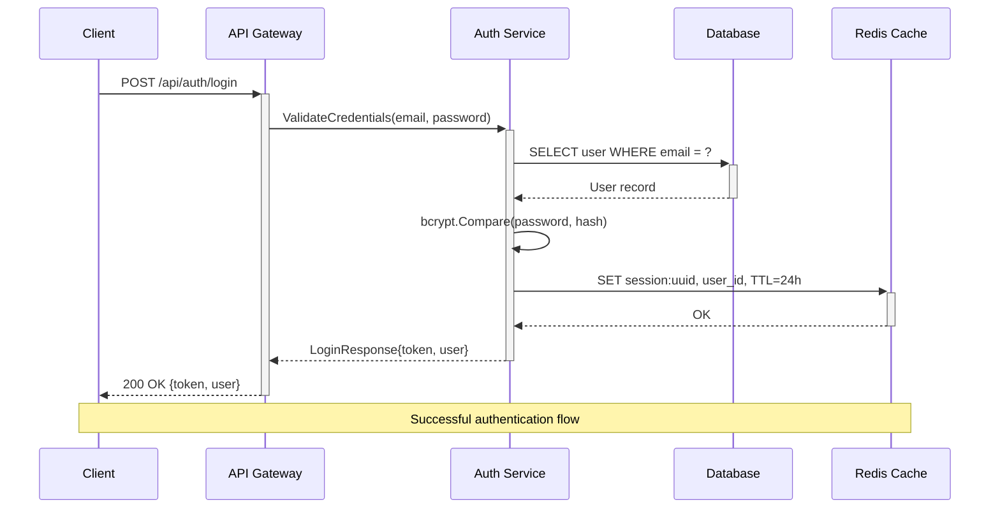
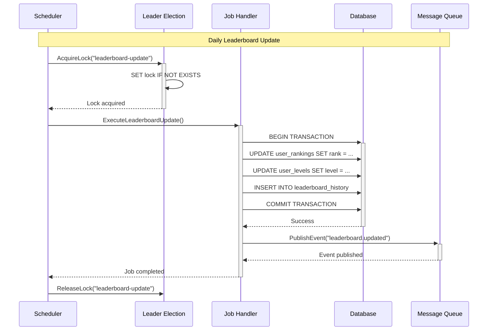
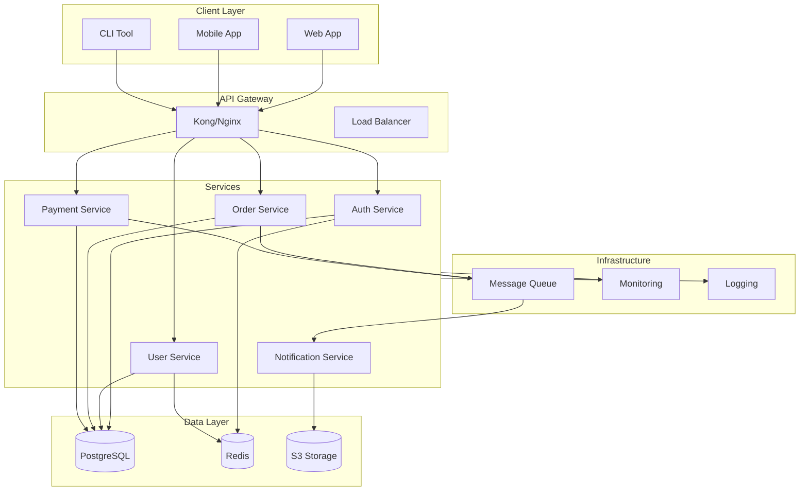
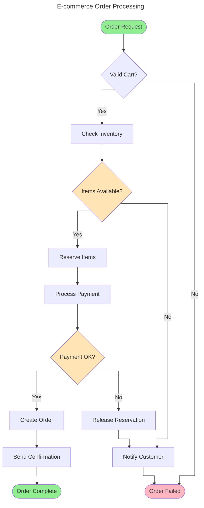
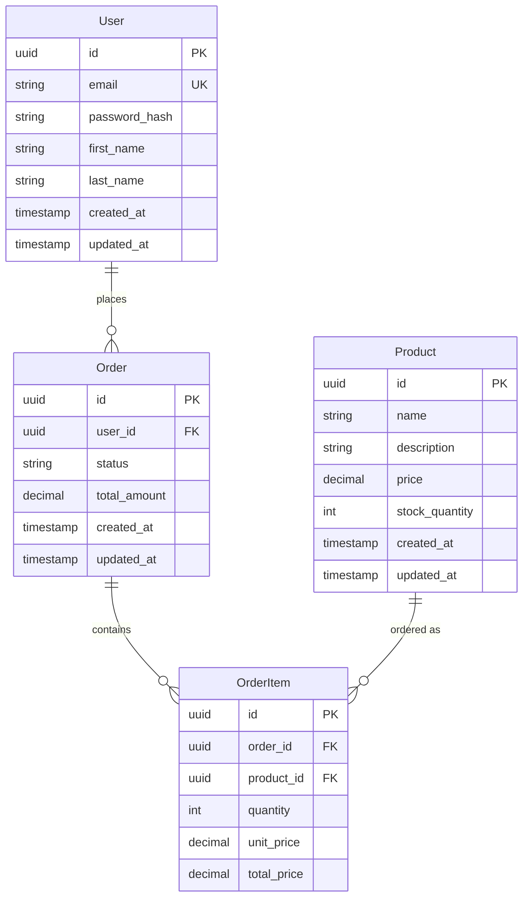
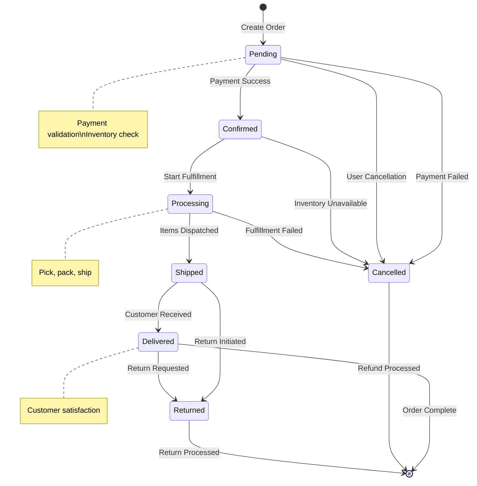
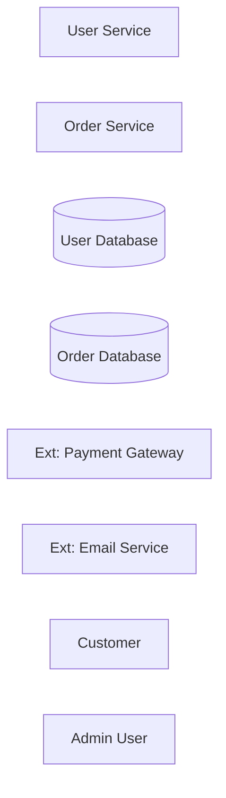
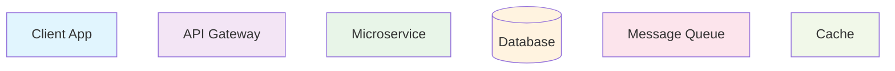

# Diagram as Code

## Status

`accepted`

## Context

We want to adopt diagram-as-code tools such as Mermaid.js to maintain architectural documentation that stays in sync with our codebase. Traditional diagramming tools create static artifacts that quickly become outdated and disconnected from the actual implementation.

Diagram-as-code provides version control, code review capabilities, and automatic rendering in documentation platforms. This approach enables living documentation that evolves with the system.

## Decision

Use Mermaid.js as the primary diagram-as-code tool for architectural documentation, with PlantUML as a secondary option for complex UML diagrams.

### Sequence Diagrams

Use sequence diagrams to document API interactions, system flows, and time-based processes:



### Cron Job Workflows

Document scheduled job execution patterns:



### System Architecture Diagrams

Visualize high-level system components and their relationships:



### Use Case Flow Diagrams

Document complex business logic with decision points:



### Database Entity Relationships

Document data models with entity relationship diagrams:



### State Machine Diagrams

Visualize entity state transitions:



### Documentation Integration

Embed diagrams in documentation with automated generation:

```yaml
# .github/workflows/docs.yml
name: Generate Documentation
on:
  push:
    branches: [main]
    paths: ['docs/**/*.md']

jobs:
  docs:
    runs-on: ubuntu-latest
    steps:
      - uses: actions/checkout@v3
      
      - name: Setup Node.js
        uses: actions/setup-node@v3
        with:
          node-version: '18'
          
      - name: Install Mermaid CLI
        run: npm install -g @mermaid-js/mermaid-cli
        
      - name: Generate diagrams
        run: |
          find docs -name "*.md" -exec grep -l "```mermaid" {} \; | \
          xargs mmdc --input {} --output diagrams/
          
      - name: Deploy to GitHub Pages
        uses: peaceiris/actions-gh-pages@v3
        with:
          github_token: ${{ secrets.GITHUB_TOKEN }}
          publish_dir: ./docs
```

### Best Practices

#### Naming Conventions

Use consistent naming for diagram elements:



#### Color Coding

Apply consistent colors for different component types:



#### Version Control

Track diagram changes with meaningful commit messages:

```bash
# Good commit messages for diagram changes
git commit -m "docs: add user registration sequence diagram"
git commit -m "arch: update microservices architecture diagram with new payment service"
git commit -m "flow: revise order processing flowchart based on new requirements"
```

## Consequences

### Positive

- **Version Control**: Diagrams are versioned alongside code changes
- **Code Review**: Architectural changes can be reviewed through pull requests
- **Living Documentation**: Diagrams stay current with system evolution
- **Consistency**: Standardized notation and styling across all diagrams
- **Automation**: Diagrams can be automatically generated and validated
- **Accessibility**: Text-based diagrams are searchable and accessible

### Negative

- **Learning Curve**: Team members need to learn diagram syntax
- **Tool Limitations**: Some complex diagrams may require specialized tools
- **Rendering Dependencies**: Requires proper tooling for diagram visualization
- **Syntax Errors**: Malformed diagram syntax can break documentation builds

## Anti-patterns

- **Overly Complex Diagrams**: Trying to show too much detail in a single diagram
- **Inconsistent Styling**: Using different colors, shapes, or naming conventions
- **Outdated Diagrams**: Not updating diagrams when system changes
- **No Context**: Diagrams without explanatory text or decision rationale
- **Wrong Diagram Type**: Using sequence diagrams for static relationships
