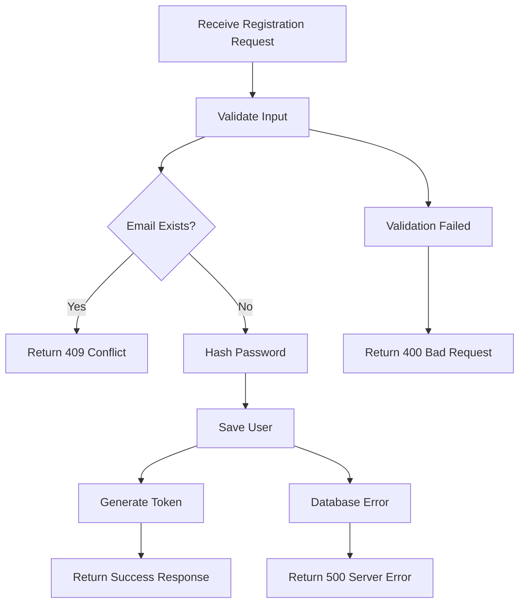

# System Flow

## Status

`accepted`

## Context

Before writing code, the most important step is to document the expected system flow in a clear, step-by-step manner. This practice prevents misunderstandings, reduces implementation errors, and provides a foundation for testing strategies.

System flows serve as blueprints that describe how a system processes requests from start to finish. They capture business logic, data transformations, external integrations, and error handling scenarios before any code is written.

### Problem

Without documented system flows, teams often encounter:
- **Implementation drift**: Code doesn't match original requirements
- **Missing edge cases**: Error scenarios not considered during development
- **Testing gaps**: Incomplete test coverage due to unclear requirements
- **Knowledge silos**: Business logic exists only in developers' minds
- **Integration issues**: Unclear service boundaries and data flow

### Benefits of System Flow Documentation

1. **Clarity**: Forces explicit thinking about requirements and edge cases
2. **Communication**: Provides common language for developers, QA, and stakeholders
3. **Testing foundation**: Enables comprehensive test case generation
4. **Maintainability**: Preserves intent for future developers
5. **Integration planning**: Clarifies service boundaries and data contracts

## Decision

We will document system flows before implementation using a structured approach that includes:

1. **Main flow**: Happy path scenario
2. **Alternative flows**: Error conditions and edge cases
3. **Prerequisites**: Required system state and inputs
4. **Postconditions**: Expected outcomes and side effects
5. **Integration points**: External service interactions

### System Flow Template

```markdown
## System Flow: [Feature Name]

### Prerequisites
- [Required conditions]
- [Input requirements]

### Main Flow
1. [Action step]
2. [Validation step]
3. [Business logic step]
4. [Data persistence step]
5. [Response step]

### Alternative Flows
- **Error Condition 1**: [Steps for handling]
- **Error Condition 2**: [Steps for handling]

### Postconditions
- [System state changes]
- [Generated outputs]
```

### Examples

#### User Registration Flow

```markdown
## System Flow: Register User

### Prerequisites
- Valid HTTP request with email, password, and name
- Database connection available
- Email service configured

### Main Flow
1. Validate request format (email format, password strength, name length)
2. Check if email already exists in database
3. Hash password using bcrypt with salt rounds 12
4. Generate unique user ID
5. Save user record to database
6. Generate JWT token with user ID as subject
7. Return success response with token and user profile

### Alternative Flows
- **Invalid email format**: Return 400 with validation error
- **Email already registered**: Return 409 with conflict error
- **Password too weak**: Return 400 with password requirements
- **Database error**: Return 500 and log error details
- **Token generation fails**: Return 500 and rollback user creation

### Postconditions
- New user record created in database
- JWT token issued for authentication
- User can proceed to authenticated features
```

#### Order Processing Flow

```markdown
## System Flow: Process Order

### Prerequisites
- Authenticated user with valid session
- Valid product IDs and quantities
- Payment service available
- Inventory service available

### Main Flow
1. Validate user authentication and session
2. Validate product availability and quantities
3. Calculate order total including taxes and shipping
4. Reserve inventory for ordered items
5. Process payment through payment gateway
6. Create order record in database
7. Send order confirmation email
8. Update inventory levels
9. Return order confirmation with tracking ID

### Alternative Flows
- **Invalid authentication**: Return 401 unauthorized
- **Product unavailable**: Return 400 with availability info
- **Insufficient inventory**: Return 400 with available quantities
- **Payment declined**: Return 402 with payment error details
- **Email service failure**: Log error but continue (non-critical)
- **Inventory update fails**: Trigger compensation workflow

### Postconditions
- Order created and confirmed
- Payment processed successfully
- Inventory levels updated
- Customer notified via email
```

### Implementation Strategy

#### 1. Flow Documentation Location

Store system flows using one of these approaches:

```
# Option 1: Alongside code (recommended)
src/
  features/
    user-registration/
      flow.md              # System flow documentation
      handler.go           # Implementation
      handler_test.go      # Tests based on flow

# Option 2: Centralized documentation
docs/
  flows/
    user-registration.md
    order-processing.md
    payment-processing.md
```

#### 2. Test Generation from Flows

Convert system flows into comprehensive test suites:

```go
// Example: User registration tests derived from flow
func TestUserRegistration(t *testing.T) {
    // Main flow test
    t.Run("successful registration", func(t *testing.T) {
        // Test complete happy path
    })
    
    // Alternative flow tests
    t.Run("invalid email format", func(t *testing.T) {
        // Test email validation
    })
    
    t.Run("email already registered", func(t *testing.T) {
        // Test duplicate email handling
    })
    
    t.Run("password too weak", func(t *testing.T) {
        // Test password validation
    })
    
    // Integration tests
    t.Run("database connection failure", func(t *testing.T) {
        // Test error handling
    })
}
```

#### 3. Flow Validation Checklist

Before implementation, verify flows include:

- [ ] All required inputs and validations
- [ ] Business logic steps clearly defined
- [ ] Error conditions and handling specified
- [ ] External service interactions documented
- [ ] Data persistence requirements outlined
- [ ] Response format and status codes defined
- [ ] Performance considerations noted
- [ ] Security requirements addressed

#### 4. Maintenance Guidelines

- **Version control**: Track flow changes alongside code changes
- **Review process**: Include flow updates in code reviews
- **Living documentation**: Update flows when requirements change
- **Traceability**: Link flows to requirements and test cases

### Tools and Formats

#### Documentation Tools
- **Markdown**: Simple, version-controllable format
- **Mermaid**: For visual flow diagrams
- **Confluence**: For team collaboration
- **ADR**: For architectural decision context

#### Flow Diagram Example



## Consequences

### Positive
- **Reduced bugs**: Comprehensive error handling planned upfront
- **Better tests**: Flow-driven test cases improve coverage
- **Faster onboarding**: New team members understand system behavior
- **Clearer APIs**: Well-defined inputs, outputs, and error responses
- **Easier debugging**: Flow documentation aids troubleshooting

### Negative
- **Additional overhead**: Requires time investment before coding
- **Maintenance burden**: Documentation must stay synchronized with code
- **Potential over-documentation**: Risk of excessive detail for simple flows

### Mitigation Strategies
- Focus on complex or critical flows first
- Use templates to reduce documentation overhead
- Integrate flow reviews into development process
- Automate validation where possible

## References

- [C4 Model for System Documentation](https://c4model.com/)
- [Event Storming for Flow Discovery](https://www.eventstorming.com/)
- [Behavior-Driven Development (BDD)](https://cucumber.io/docs/bdd/)
- [Mermaid Diagram Syntax](https://mermaid-js.github.io/mermaid/)

Consider the usecase of user registration:

```md
System flow: Register User
1. validate email format, password length and name format
2. check if email is registered
3. encrypt the password
4. save the user
5. return a token with user id as a subject
```

We can translate them to test cases such as this:

```
# Validate steps
it validates the request
it checks if the email is registered
  when registered
  when not registered
it encrypts the password
it saves the user
it returns a token

# Validates full flow
it registers a new user
  when success
  when failed
```
