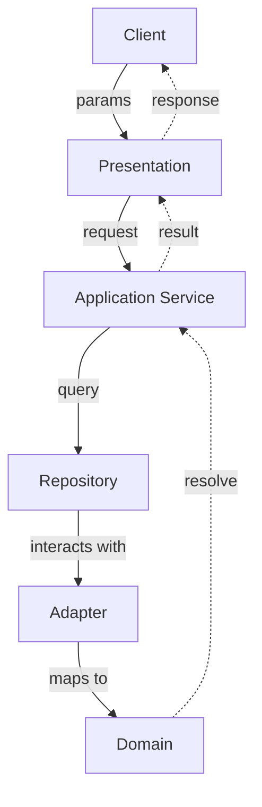

# Use strict layering

## Status

`draft`

## Context

In layered application, we define several layers that are (mostly) split based on responsibilty.

The common layers includes but not limited to:

- presentation
- application service (aka usecase)
- repository (data facade layer, not specific to database)
- domain

A request from a client will go down the layer before getting back a request.

Each layer above also depends on the layer below directly. However, the layer below cannot call the layer above, which will result in reverse dependency.

This issue is more common in strongly typed language like golang because the types needs to be imported to fulfil the interface.

In your application, you may choose to add more layers to abstract functionality.

## Decision

Structuring your app based on layers above can be confusing, because when we think of layers, we think of hierarchy. However, we cannot design the folder structure to be bestein golang.

Below we see an example of how to structure the app, and the reasons behind it.

```
presentation/
domain/
  application/
    repository/
adapter/
  postgres/
  stripe/
```

In diagram, it may look like this:



### Presentation

The `presentation` layer is the layer where the client communicates with the application. The folders are usually named based on the implementation, for example `rest` for HTTP APIs, `graphql`, and `grpc`. For `cli`, we just place them in the `cmd` folder because that seems to be the convention for golang.

```
rest/
  middleware/
  request/
  response/
  api/v1
grpc/
graphql/
cmd/
```

This layer is responsible for parsing the request (query string, form, body, http parameters) into a type definition that the application service can consume. 

This layer also handles marshaling (serialization in other languages) to json, csv, html etc, depending on what your application is serving.

If the application service returns error, the presentation layer is also responsible for the formatting and translation of the error message.

Other responsibilities includes pre-validation as well as access control (authorization).

The `presentation` layer should not have any business logic or orchestration.

### Application Service

The application service (or commonly called usecase) is where your application logic lies.


There is no business logic in this layer. The code should be written in a step-by-step way that describes the operation to be carried out.

### Domain 

The layer where your business logic resides.

